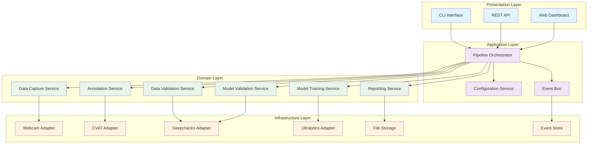

# AI Model Validation PoC - System Architecture

## Architecture Overview

This document defines the system architecture for the AI Model Validation PoC, designed with London School TDD principles prioritizing testability, dependency injection, and interface-based design.

## Core Architecture Principles

### 1. London School TDD Design
- **Interface Segregation**: All external dependencies behind testable interfaces
- **Dependency Injection**: Constructor injection with IoC container
- **Service Boundaries**: Clear separation of concerns with contract testing
- **Event-Driven**: Asynchronous coordination with message passing

### 2. Testability First
- All external tools (CVAT, Deepchecks, Ultralytics) wrapped in protocols
- Mock implementations for all interfaces
- Contract tests for service boundaries
- Integration test harnesses for external tools

### 3. Dependency Inversion
- High-level modules don't depend on low-level modules
- Both depend on abstractions (protocols/interfaces)
- Abstractions don't depend on details
- Details depend on abstractions

## System Architecture Diagram



## Service Architecture

### Core Interfaces (Protocols)

```python
# src/interfaces/data_capture.py
from typing import Protocol, Dict, Any, List
from pathlib import Path
from dataclasses import dataclass

@dataclass
class CaptureConfig:
    resolution: tuple[int, int]
    format: str
    output_dir: Path
    session_id: str

@dataclass
class CaptureResult:
    success: bool
    file_path: Path | None
    metadata: Dict[str, Any]
    error: str | None

class IDataCapture(Protocol):
    """Interface for data capture operations"""
    
    async def capture_image(self, config: CaptureConfig) -> CaptureResult:
        """Capture single image from webcam"""
        ...
    
    async def capture_video(self, config: CaptureConfig, duration: int) -> CaptureResult:
        """Capture video from webcam"""
        ...
    
    async def list_available_cameras(self) -> List[Dict[str, Any]]:
        """List available camera devices"""
        ...

class IWebcamDriver(Protocol):
    """Low-level webcam interface"""
    
    def initialize(self) -> bool:
        """Initialize camera connection"""
        ...
    
    def capture_frame(self) -> bytes | None:
        """Capture single frame"""
        ...
    
    def release(self) -> None:
        """Release camera resources"""
        ...
```

```python
# src/interfaces/annotation.py
from typing import Protocol, Dict, Any, List
from pathlib import Path
from dataclasses import dataclass
from enum import Enum

class AnnotationFormat(Enum):
    COCO = "coco"
    YOLO = "yolo"
    PASCAL_VOC = "pascal_voc"

@dataclass
class AnnotationTask:
    id: str
    name: str
    data_path: Path
    format: AnnotationFormat
    class_names: List[str]

@dataclass
class AnnotationResult:
    task_id: str
    export_path: Path
    annotation_count: int
    completion_percentage: float

class IAnnotationService(Protocol):
    """Interface for data annotation operations"""
    
    async def create_task(self, task: AnnotationTask) -> str:
        """Create annotation task"""
        ...
    
    async def get_task_status(self, task_id: str) -> Dict[str, Any]:
        """Get annotation progress"""
        ...
    
    async def export_annotations(self, task_id: str, format: AnnotationFormat) -> AnnotationResult:
        """Export completed annotations"""
        ...

class ICVATAdapter(Protocol):
    """Low-level CVAT integration"""
    
    async def start_server(self) -> bool:
        """Start CVAT server"""
        ...
    
    async def health_check(self) -> bool:
        """Check CVAT server health"""
        ...
    
    async def create_project(self, name: str, labels: List[str]) -> int:
        """Create CVAT project"""
        ...
```

```python
# src/interfaces/validation.py
from typing import Protocol, Dict, Any, List
from pathlib import Path
from dataclasses import dataclass
from enum import Enum

class ValidationSeverity(Enum):
    INFO = "info"
    WARNING = "warning"
    ERROR = "error"
    CRITICAL = "critical"

@dataclass
class ValidationIssue:
    severity: ValidationSeverity
    category: str
    message: str
    details: Dict[str, Any]
    recommendation: str

@dataclass
class ValidationReport:
    dataset_path: Path
    issues: List[ValidationIssue]
    summary: Dict[str, Any]
    score: float
    passed: bool

class IDataValidator(Protocol):
    """Interface for data validation operations"""
    
    async def validate_dataset(self, dataset_path: Path, config: Dict[str, Any]) -> ValidationReport:
        """Validate dataset quality"""
        ...
    
    async def validate_annotations(self, annotations_path: Path) -> ValidationReport:
        """Validate annotation quality"""
        ...

class IModelValidator(Protocol):
    """Interface for model validation operations"""
    
    async def validate_model(self, model_path: Path, test_data: Path, config: Dict[str, Any]) -> ValidationReport:
        """Validate trained model performance"""
        ...
    
    async def benchmark_model(self, model_path: Path, benchmark_data: Path) -> Dict[str, float]:
        """Benchmark model performance metrics"""
        ...

class IDeepChecksAdapter(Protocol):
    """Low-level Deepchecks integration"""
    
    async def run_vision_checks(self, dataset_path: Path, checks: List[str]) -> Dict[str, Any]:
        """Run vision-specific data checks"""
        ...
    
    async def run_model_checks(self, model_path: Path, data_path: Path, checks: List[str]) -> Dict[str, Any]:
        """Run model performance checks"""
        ...
```

```python
# src/interfaces/training.py
from typing import Protocol, Dict, Any, List, Callable
from pathlib import Path
from dataclasses import dataclass
from enum import Enum

class ModelType(Enum):
    YOLOV8N = "yolov8n"
    YOLOV8S = "yolov8s"
    YOLOV8M = "yolov8m"

@dataclass
class TrainingConfig:
    model_type: ModelType
    dataset_path: Path
    epochs: int
    batch_size: int
    learning_rate: float
    image_size: int
    device: str = "auto"

@dataclass
class TrainingProgress:
    epoch: int
    total_epochs: int
    loss: float
    metrics: Dict[str, float]
    eta_seconds: int

@dataclass
class TrainingResult:
    model_path: Path
    config_path: Path
    metrics: Dict[str, float]
    training_time: float
    best_epoch: int

TrainingCallback = Callable[[TrainingProgress], None]

class IModelTrainer(Protocol):
    """Interface for model training operations"""
    
    async def train_model(self, config: TrainingConfig, callback: TrainingCallback | None = None) -> TrainingResult:
        """Train computer vision model"""
        ...
    
    async def resume_training(self, checkpoint_path: Path, config: TrainingConfig) -> TrainingResult:
        """Resume training from checkpoint"""
        ...
    
    async def evaluate_model(self, model_path: Path, test_data: Path) -> Dict[str, float]:
        """Evaluate model on test data"""
        ...

class IUltralyticsAdapter(Protocol):
    """Low-level Ultralytics integration"""
    
    def load_model(self, model_type: str) -> Any:
        """Load pretrained model"""
        ...
    
    async def train_yolo(self, model: Any, data_config: Path, **kwargs) -> Dict[str, Any]:
        """Train YOLO model"""
        ...
    
    async def validate_yolo(self, model: Any, data_config: Path) -> Dict[str, float]:
        """Validate YOLO model"""
        ...
```

### Event System Architecture

```python
# src/interfaces/events.py
from typing import Protocol, Dict, Any, Callable, List
from dataclasses import dataclass
from datetime import datetime
from enum import Enum

class EventType(Enum):
    PIPELINE_STARTED = "pipeline.started"
    PIPELINE_COMPLETED = "pipeline.completed"
    PIPELINE_FAILED = "pipeline.failed"
    STAGE_STARTED = "stage.started"
    STAGE_COMPLETED = "stage.completed"
    STAGE_FAILED = "stage.failed"
    DATA_CAPTURED = "data.captured"
    ANNOTATIONS_COMPLETED = "annotations.completed"
    VALIDATION_COMPLETED = "validation.completed"
    TRAINING_STARTED = "training.started"
    TRAINING_PROGRESS = "training.progress"
    TRAINING_COMPLETED = "training.completed"

@dataclass
class Event:
    id: str
    type: EventType
    payload: Dict[str, Any]
    timestamp: datetime
    correlation_id: str
    source: str

EventHandler = Callable[[Event], None]

class IEventBus(Protocol):
    """Interface for event-driven communication"""
    
    async def publish(self, event: Event) -> None:
        """Publish event to bus"""
        ...
    
    async def subscribe(self, event_type: EventType, handler: EventHandler) -> str:
        """Subscribe to event type"""
        ...
    
    async def unsubscribe(self, subscription_id: str) -> None:
        """Unsubscribe from events"""
        ...

class IEventStore(Protocol):
    """Interface for event persistence"""
    
    async def store_event(self, event: Event) -> None:
        """Store event for replay/audit"""
        ...
    
    async def get_events(self, correlation_id: str) -> List[Event]:
        """Get events by correlation ID"""
        ...
    
    async def replay_events(self, from_timestamp: datetime) -> List[Event]:
        """Replay events from timestamp"""
        ...
```

### Pipeline Orchestration

```python
# src/services/pipeline_orchestrator.py
from typing import Dict, Any, List
from dataclasses import dataclass
from pathlib import Path
import asyncio
import uuid
from datetime import datetime

from ..interfaces.data_capture import IDataCapture, CaptureConfig
from ..interfaces.annotation import IAnnotationService, AnnotationTask
from ..interfaces.validation import IDataValidator, IModelValidator
from ..interfaces.training import IModelTrainer, TrainingConfig
from ..interfaces.events import IEventBus, Event, EventType

@dataclass
class PipelineConfig:
    session_id: str
    output_dir: Path
    capture_config: Dict[str, Any]
    annotation_config: Dict[str, Any]
    validation_config: Dict[str, Any]
    training_config: Dict[str, Any]

@dataclass
class PipelineResult:
    session_id: str
    success: bool
    stages_completed: int
    total_stages: int
    execution_time: float
    report_path: Path | None
    error: str | None

class PipelineOrchestrator:
    """Orchestrates the complete ML pipeline"""
    
    def __init__(
        self,
        data_capture: IDataCapture,
        annotation_service: IAnnotationService,
        data_validator: IDataValidator,
        model_validator: IModelValidator,
        model_trainer: IModelTrainer,
        event_bus: IEventBus
    ):
        self._data_capture = data_capture
        self._annotation_service = annotation_service
        self._data_validator = data_validator
        self._model_validator = model_validator
        self._model_trainer = model_trainer
        self._event_bus = event_bus
        
    async def execute_pipeline(self, config: PipelineConfig) -> PipelineResult:
        """Execute complete ML pipeline"""
        start_time = datetime.now()
        correlation_id = str(uuid.uuid4())
        
        # Publish pipeline started event
        await self._publish_event(
            EventType.PIPELINE_STARTED,
            {"session_id": config.session_id, "config": config.__dict__},
            correlation_id
        )
        
        try:
            stages = [
                ("data_capture", self._execute_data_capture),
                ("annotation", self._execute_annotation),
                ("data_validation", self._execute_data_validation),
                ("model_training", self._execute_model_training),
                ("model_validation", self._execute_model_validation),
                ("report_generation", self._execute_report_generation)
            ]
            
            stage_results = {}
            
            for i, (stage_name, stage_func) in enumerate(stages):
                await self._publish_event(
                    EventType.STAGE_STARTED,
                    {"stage": stage_name, "stage_number": i + 1},
                    correlation_id
                )
                
                try:
                    result = await stage_func(config, stage_results)
                    stage_results[stage_name] = result
                    
                    await self._publish_event(
                        EventType.STAGE_COMPLETED,
                        {"stage": stage_name, "result": result},
                        correlation_id
                    )
                    
                except Exception as e:
                    await self._publish_event(
                        EventType.STAGE_FAILED,
                        {"stage": stage_name, "error": str(e)},
                        correlation_id
                    )
                    raise
            
            execution_time = (datetime.now() - start_time).total_seconds()
            
            result = PipelineResult(
                session_id=config.session_id,
                success=True,
                stages_completed=len(stages),
                total_stages=len(stages),
                execution_time=execution_time,
                report_path=stage_results.get("report_generation", {}).get("report_path"),
                error=None
            )
            
            await self._publish_event(
                EventType.PIPELINE_COMPLETED,
                {"result": result.__dict__},
                correlation_id
            )
            
            return result
            
        except Exception as e:
            execution_time = (datetime.now() - start_time).total_seconds()
            
            result = PipelineResult(
                session_id=config.session_id,
                success=False,
                stages_completed=len([k for k in stage_results.keys()]),
                total_stages=len(stages),
                execution_time=execution_time,
                report_path=None,
                error=str(e)
            )
            
            await self._publish_event(
                EventType.PIPELINE_FAILED,
                {"result": result.__dict__, "error": str(e)},
                correlation_id
            )
            
            return result
    
    async def _execute_data_capture(self, config: PipelineConfig, results: Dict[str, Any]) -> Dict[str, Any]:
        """Execute data capture stage"""
        capture_config = CaptureConfig(**config.capture_config)
        
        # Capture images
        images = []
        for i in range(config.capture_config.get("num_images", 10)):
            result = await self._data_capture.capture_image(capture_config)
            if result.success:
                images.append(result.file_path)
        
        await self._publish_event(
            EventType.DATA_CAPTURED,
            {"images_captured": len(images), "paths": [str(p) for p in images]},
            config.session_id
        )
        
        return {
            "captured_images": images,
            "output_dir": capture_config.output_dir
        }
    
    async def _publish_event(self, event_type: EventType, payload: Dict[str, Any], correlation_id: str) -> None:
        """Publish event to event bus"""
        event = Event(
            id=str(uuid.uuid4()),
            type=event_type,
            payload=payload,
            timestamp=datetime.now(),
            correlation_id=correlation_id,
            source="pipeline_orchestrator"
        )
        await self._event_bus.publish(event)
```

### Dependency Injection Container

```python
# src/container.py
from typing import Dict, Any, TypeVar, Type, Callable
from dataclasses import dataclass
import inspect

T = TypeVar('T')

@dataclass
class ServiceRegistration:
    service_type: Type
    implementation: Type | Callable
    lifetime: str = "transient"  # transient, singleton, scoped

class Container:
    """Dependency injection container"""
    
    def __init__(self):
        self._services: Dict[Type, ServiceRegistration] = {}
        self._singletons: Dict[Type, Any] = {}
        
    def register_transient(self, service_type: Type[T], implementation: Type[T] | Callable[[], T]) -> None:
        """Register transient service (new instance each time)"""
        self._services[service_type] = ServiceRegistration(
            service_type=service_type,
            implementation=implementation,
            lifetime="transient"
        )
    
    def register_singleton(self, service_type: Type[T], implementation: Type[T] | Callable[[], T]) -> None:
        """Register singleton service (same instance each time)"""
        self._services[service_type] = ServiceRegistration(
            service_type=service_type,
            implementation=implementation,
            lifetime="singleton"
        )
    
    def register_instance(self, service_type: Type[T], instance: T) -> None:
        """Register existing instance as singleton"""
        self._services[service_type] = ServiceRegistration(
            service_type=service_type,
            implementation=lambda: instance,
            lifetime="singleton"
        )
        self._singletons[service_type] = instance
    
    def resolve(self, service_type: Type[T]) -> T:
        """Resolve service instance"""
        if service_type not in self._services:
            raise ValueError(f"Service {service_type} not registered")
        
        registration = self._services[service_type]
        
        # Return singleton if already created
        if registration.lifetime == "singleton" and service_type in self._singletons:
            return self._singletons[service_type]
        
        # Create instance
        if callable(registration.implementation) and not inspect.isclass(registration.implementation):
            # It's a factory function
            instance = registration.implementation()
        else:
            # It's a class, resolve constructor dependencies
            instance = self._create_instance(registration.implementation)
        
        # Store singleton
        if registration.lifetime == "singleton":
            self._singletons[service_type] = instance
        
        return instance
    
    def _create_instance(self, implementation_type: Type[T]) -> T:
        """Create instance with dependency injection"""
        # Get constructor signature
        sig = inspect.signature(implementation_type.__init__)
        
        # Resolve dependencies
        kwargs = {}
        for param_name, param in sig.parameters.items():
            if param_name == "self":
                continue
            
            if param.annotation != param.empty:
                # Resolve dependency
                dependency = self.resolve(param.annotation)
                kwargs[param_name] = dependency
        
        return implementation_type(**kwargs)

# Container configuration
def configure_container() -> Container:
    """Configure dependency injection container"""
    container = Container()
    
    # Register infrastructure services
    from .adapters.webcam_adapter import WebcamAdapter
    from .adapters.cvat_adapter import CVATAdapter
    from .adapters.deepchecks_adapter import DeepChecksAdapter
    from .adapters.ultralytics_adapter import UltralyticsAdapter
    from .infrastructure.file_storage import FileStorage
    from .infrastructure.event_store import InMemoryEventStore
    from .infrastructure.event_bus import AsyncEventBus
    
    container.register_transient(IWebcamDriver, WebcamAdapter)
    container.register_transient(ICVATAdapter, CVATAdapter)
    container.register_transient(IDeepChecksAdapter, DeepChecksAdapter)
    container.register_transient(IUltralyticsAdapter, UltralyticsAdapter)
    container.register_singleton(IEventStore, InMemoryEventStore)
    container.register_singleton(IEventBus, AsyncEventBus)
    
    # Register domain services
    from .services.data_capture_service import DataCaptureService
    from .services.annotation_service import AnnotationService
    from .services.validation_service import ValidationService
    from .services.training_service import TrainingService
    
    container.register_transient(IDataCapture, DataCaptureService)
    container.register_transient(IAnnotationService, AnnotationService)
    container.register_transient(IDataValidator, ValidationService)
    container.register_transient(IModelValidator, ValidationService)
    container.register_transient(IModelTrainer, TrainingService)
    
    # Register application services
    container.register_transient(PipelineOrchestrator, PipelineOrchestrator)
    
    return container
```

### Test Architecture

```python
# tests/conftest.py
import pytest
from unittest.mock import Mock, AsyncMock
from pathlib import Path
import tempfile
from typing import Dict, Any

from src.interfaces.data_capture import IDataCapture, IWebcamDriver
from src.interfaces.annotation import IAnnotationService, ICVATAdapter
from src.interfaces.validation import IDataValidator, IModelValidator, IDeepChecksAdapter
from src.interfaces.training import IModelTrainer, IUltralyticsAdapter
from src.interfaces.events import IEventBus, IEventStore
from src.container import Container

@pytest.fixture
def temp_dir():
    """Temporary directory for test files"""
    with tempfile.TemporaryDirectory() as tmp:
        yield Path(tmp)

@pytest.fixture
def mock_webcam_driver():
    """Mock webcam driver"""
    mock = Mock(spec=IWebcamDriver)
    mock.initialize.return_value = True
    mock.capture_frame.return_value = b"fake_image_data"
    return mock

@pytest.fixture
def mock_data_capture():
    """Mock data capture service"""
    mock = AsyncMock(spec=IDataCapture)
    return mock

@pytest.fixture
def mock_cvat_adapter():
    """Mock CVAT adapter"""
    mock = AsyncMock(spec=ICVATAdapter)
    mock.start_server.return_value = True
    mock.health_check.return_value = True
    mock.create_project.return_value = 123
    return mock

@pytest.fixture
def mock_annotation_service():
    """Mock annotation service"""
    mock = AsyncMock(spec=IAnnotationService)
    return mock

@pytest.fixture
def mock_deepchecks_adapter():
    """Mock Deepchecks adapter"""
    mock = AsyncMock(spec=IDeepChecksAdapter)
    mock.run_vision_checks.return_value = {"overall_score": 0.85}
    mock.run_model_checks.return_value = {"mAP50": 0.45}
    return mock

@pytest.fixture
def mock_data_validator():
    """Mock data validator"""
    mock = AsyncMock(spec=IDataValidator)
    return mock

@pytest.fixture
def mock_model_validator():
    """Mock model validator"""
    mock = AsyncMock(spec=IModelValidator)
    return mock

@pytest.fixture
def mock_ultralytics_adapter():
    """Mock Ultralytics adapter"""
    mock = AsyncMock(spec=IUltralyticsAdapter)
    mock.load_model.return_value = Mock()
    mock.train_yolo.return_value = {"mAP50": 0.45, "precision": 0.6}
    return mock

@pytest.fixture
def mock_model_trainer():
    """Mock model trainer"""
    mock = AsyncMock(spec=IModelTrainer)
    return mock

@pytest.fixture
def mock_event_bus():
    """Mock event bus"""
    mock = AsyncMock(spec=IEventBus)
    return mock

@pytest.fixture
def mock_event_store():
    """Mock event store"""
    mock = AsyncMock(spec=IEventStore)
    return mock

@pytest.fixture
def test_container(
    mock_webcam_driver,
    mock_cvat_adapter,
    mock_deepchecks_adapter,
    mock_ultralytics_adapter,
    mock_event_bus,
    mock_event_store
):
    """Test container with mocked dependencies"""
    container = Container()
    
    # Register mocks
    container.register_instance(IWebcamDriver, mock_webcam_driver)
    container.register_instance(ICVATAdapter, mock_cvat_adapter)
    container.register_instance(IDeepChecksAdapter, mock_deepchecks_adapter)
    container.register_instance(IUltralyticsAdapter, mock_ultralytics_adapter)
    container.register_instance(IEventBus, mock_event_bus)
    container.register_instance(IEventStore, mock_event_store)
    
    return container
```

```python
# tests/unit/test_pipeline_orchestrator.py
import pytest
from unittest.mock import AsyncMock, Mock
from pathlib import Path
from datetime import datetime

from src.services.pipeline_orchestrator import PipelineOrchestrator, PipelineConfig
from src.interfaces.events import EventType

@pytest.mark.asyncio
async def test_pipeline_orchestrator_successful_execution(
    mock_data_capture,
    mock_annotation_service,
    mock_data_validator,
    mock_model_validator,
    mock_model_trainer,
    mock_event_bus,
    temp_dir
):
    """Test successful pipeline execution"""
    # Arrange
    orchestrator = PipelineOrchestrator(
        data_capture=mock_data_capture,
        annotation_service=mock_annotation_service,
        data_validator=mock_data_validator,
        model_validator=mock_model_validator,
        model_trainer=mock_model_trainer,
        event_bus=mock_event_bus
    )
    
    config = PipelineConfig(
        session_id="test-session",
        output_dir=temp_dir,
        capture_config={"num_images": 5, "resolution": (640, 480)},
        annotation_config={},
        validation_config={},
        training_config={}
    )
    
    # Mock successful stage results
    mock_data_capture.capture_image.return_value = Mock(
        success=True,
        file_path=temp_dir / "image.jpg",
        metadata={},
        error=None
    )
    
    # Act
    result = await orchestrator.execute_pipeline(config)
    
    # Assert
    assert result.success is True
    assert result.stages_completed == 6
    assert result.total_stages == 6
    assert result.error is None
    
    # Verify events were published
    assert mock_event_bus.publish.call_count >= 2  # At least started and completed
    
    # Verify pipeline started event
    start_event_call = mock_event_bus.publish.call_args_list[0]
    start_event = start_event_call[0][0]
    assert start_event.type == EventType.PIPELINE_STARTED
    assert start_event.payload["session_id"] == "test-session"

@pytest.mark.asyncio
async def test_pipeline_orchestrator_stage_failure(
    mock_data_capture,
    mock_annotation_service,
    mock_data_validator,
    mock_model_validator,
    mock_model_trainer,
    mock_event_bus,
    temp_dir
):
    """Test pipeline handles stage failure gracefully"""
    # Arrange
    orchestrator = PipelineOrchestrator(
        data_capture=mock_data_capture,
        annotation_service=mock_annotation_service,
        data_validator=mock_data_validator,
        model_validator=mock_model_validator,
        model_trainer=mock_model_trainer,
        event_bus=mock_event_bus
    )
    
    config = PipelineConfig(
        session_id="test-session",
        output_dir=temp_dir,
        capture_config={"num_images": 5},
        annotation_config={},
        validation_config={},
        training_config={}
    )
    
    # Mock failure in data capture
    mock_data_capture.capture_image.side_effect = Exception("Camera not found")
    
    # Act
    result = await orchestrator.execute_pipeline(config)
    
    # Assert
    assert result.success is False
    assert result.stages_completed == 0
    assert result.error == "Camera not found"
    
    # Verify failure event was published
    failure_events = [
        call for call in mock_event_bus.publish.call_args_list
        if call[0][0].type == EventType.PIPELINE_FAILED
    ]
    assert len(failure_events) > 0
```

### Contract Testing

```python
# tests/contract/test_data_capture_contract.py
import pytest
from abc import ABC, abstractmethod
from pathlib import Path

from src.interfaces.data_capture import IDataCapture, CaptureConfig, CaptureResult

class DataCaptureContractTest(ABC):
    """Contract test for IDataCapture implementations"""
    
    @abstractmethod
    def create_data_capture(self) -> IDataCapture:
        """Factory method for creating IDataCapture implementation"""
        pass
    
    @pytest.mark.asyncio
    async def test_capture_image_success(self, temp_dir):
        """Test successful image capture"""
        # Arrange
        data_capture = self.create_data_capture()
        config = CaptureConfig(
            resolution=(640, 480),
            format="JPEG",
            output_dir=temp_dir,
            session_id="test"
        )
        
        # Act
        result = await data_capture.capture_image(config)
        
        # Assert
        assert isinstance(result, CaptureResult)
        if result.success:
            assert result.file_path is not None
            assert result.file_path.exists()
            assert result.error is None
        else:
            assert result.error is not None
    
    @pytest.mark.asyncio
    async def test_capture_image_invalid_config(self, temp_dir):
        """Test image capture with invalid configuration"""
        # Arrange
        data_capture = self.create_data_capture()
        config = CaptureConfig(
            resolution=(0, 0),  # Invalid resolution
            format="INVALID",
            output_dir=temp_dir,
            session_id="test"
        )
        
        # Act
        result = await data_capture.capture_image(config)
        
        # Assert
        assert isinstance(result, CaptureResult)
        assert result.success is False
        assert result.error is not None

# Concrete test implementations
class TestDataCaptureServiceContract(DataCaptureContractTest):
    """Contract test for DataCaptureService implementation"""
    
    def create_data_capture(self) -> IDataCapture:
        from src.services.data_capture_service import DataCaptureService
        from tests.conftest import mock_webcam_driver
        return DataCaptureService(mock_webcam_driver())

class TestMockDataCaptureContract(DataCaptureContractTest):
    """Contract test for mock DataCapture implementation"""
    
    def create_data_capture(self) -> IDataCapture:
        from tests.mocks.mock_data_capture import MockDataCapture
        return MockDataCapture()
```

This architecture provides:

1. **Complete Interface Segregation**: All external dependencies behind protocols
2. **Dependency Injection**: Constructor injection with IoC container
3. **Event-Driven Architecture**: Asynchronous coordination with message passing
4. **Testability**: Mock implementations and contract tests for all interfaces
5. **Service Boundaries**: Clear separation between domain services
6. **London School TDD Support**: All components designed for easy mocking and testing

The architecture supports the full SPARC methodology while maintaining testability as the primary concern.